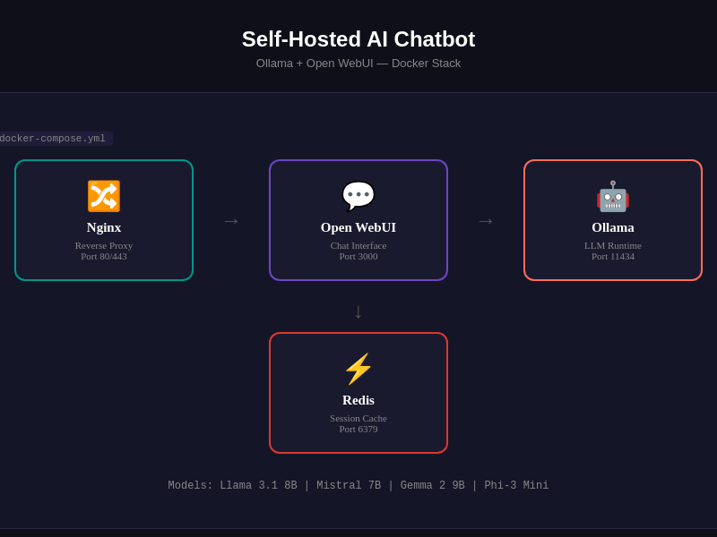

# Self Hosted Ai Chatbot

<p align="center">
</p>

    

> Selbstgehosteter KI-Chatbot mit Open WebUI und Ollama (DSGVO-konform)

## Overview

Komplett-Lösung für einen selbstgehosteten KI-Chatbot. Kombiniert Ollama (LLM-Runtime) mit Open WebUI (Chat-Interface) und Nginx (Reverse Proxy). DSGVO-konform, kein Cloud-Bezug.

## Features

- 100% self-hosted, kein Cloud-Bezug
- Open WebUI als Chat-Interface
- Ollama als LLM-Runtime
- Nginx Reverse Proxy mit SSL
- GPU-Unterstützung (optional)
- Einfache Setup-Scripte

## Tech Stack

| Tech | Zweck |
|------|-------|
| Ollama | LLM-Runtime |
| Open WebUI | Chat-Interface |
| Nginx | Reverse Proxy |
| Docker Compose | Orchestrierung |

## Quick Start

```bash
docker compose up -d
# Oeffne http://localhost:3000
```

## Screenshots

**System-Architektur**


**Docker Container Übersicht**


**Projekt-Übersicht**


**Setup-Script Ausführung**


**Chatbot Architektur-Detail**



---

## Contributing

Beiträge sind willkommen! Bitte erstelle einen Issue oder Pull Request.

## License

MIT License — siehe [LICENSE](LICENSE).

<p align="center">
</p>