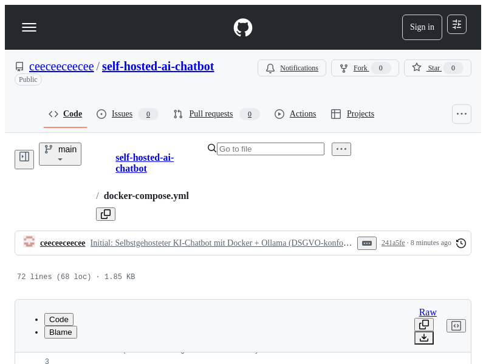
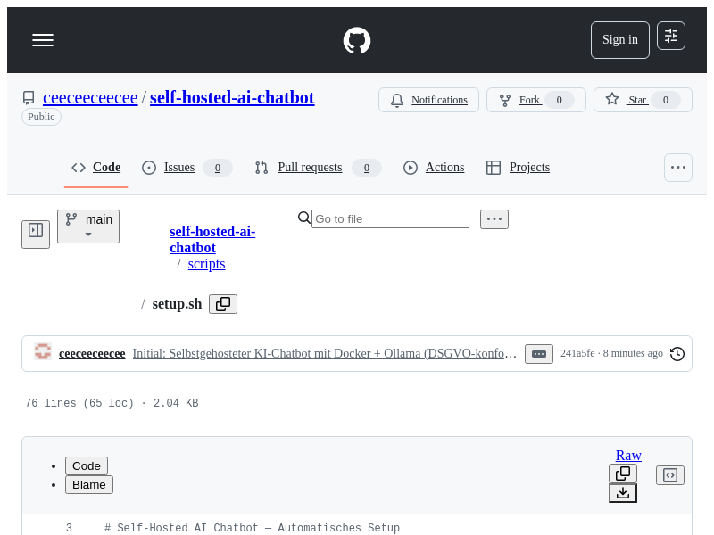
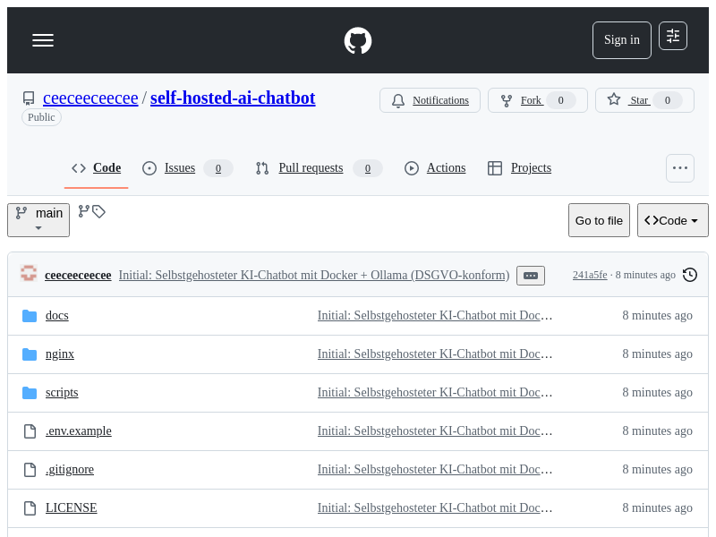

# Self-Hosted AI Chatbot

[](https://ollama.ai)
[](https://github.com/open-webui/open-webui)
[](https://www.docker.com)
[](LICENSE)
[]()

> Selbstgehosteter KI-Chatbot mit Docker + Ollama — DSGVO-konform, kein Cloud-Abhängigkeit, volle Kontrolle über deine Daten.

A self-hosted AI chatbot using Docker + Ollama — GDPR-compliant, no cloud dependency, full control over your data.

---

## 🔒 Warum selbstgehostet?

- **DSGVO-konform:** Keine Daten verlassen deinen Server
- **Keine monatlichen Kosten:** Einmalige Hardware-Investition, kein SaaS-Abo
- **Volle Kontrolle:** Modell, System-Prompts, Daten — alles in deiner Hand
- **Offline verfügbar:** Auch ohne Internetverbindung nutzbar
- **Datenschutz:** Kein Teilen von Konversationen mit Drittanbietern

## 🏗️ Architektur

```
+------------------+     +------------------+     +------------------+
|   Nginx (80/443) | --> |   Open WebUI     | --> |     Ollama       |
|   Reverse Proxy  |     |   Chat-Oberfläche |     |   LLM Runtime    |
+------------------+     +------------------+     +------------------+
                                  |
                           +-------------+
                           |    Redis    |
                           |   (Cache)   |
                           +-------------+
```

## 🚀 Schnellstart (3 Befehle)

```bash
git clone https://github.com/ceeceeceecee/self-hosted-ai-chatbot.git
cd self-hosted-ai-chatbot
cp .env.example .env && docker compose up -d
```

Danach: `http://localhost:3000` öffnen und loslegen.

## 🤖 Unterstützte Modelle

| Modell | RAM | Use Case |
|--------|-----|----------|
| Llama 3.1 8B | 8 GB | Allround, gut für allgemeine Fragen |
| Mistral 7B | 8 GB | Schnell, effizient |
| Gemma 2 9B | 8 GB | Google-Modell, stark bei Logik |
| Llama 3.1 70B | 48 GB | Komplexe Aufgaben, längere Texte |
| Mixtral 8x7B | 48 GB | MoE-Architektur, vielseitig |
| Phi-3 Mini | 4 GB | Leichtgewichtig, ideal für schwache Hardware |

Siehe [docs/models.md](docs/models.md) für Details.

## 📁 Projektstruktur

```
self-hosted-ai-chatbot/
├── docker-compose.yml          # CPU-Variante
├── docker-compose.gpu.yml      # NVIDIA GPU-Variante
├── .env.example                # Umgebungsvariablen
├── scripts/
│   ├── setup.sh                # Automatisches Setup
│   └── update.sh               # Update mit Backup
├── nginx/
│   └── nginx.conf              # Reverse Proxy Konfiguration
├── docs/
│   ├── models.md               # Modell-Übersicht
│   └── customization.md        # Anpassung & Branding
├── .gitignore
└── LICENSE
```

## 🛠️ Features

- **GPU-Unterstützung:** NVIDIA CUDA aus der Box
- **Automatisches Setup:** Ein Skript für die komplette Installation
- **Update-Skript:** Sicherer Update-Prozess mit automatischem Backup
- **Reverse Proxy:** Nginx-Konfiguration mit SSL-Ready-Setup
- **Anpassbar:** Eigene System-Prompts, Branding, Modelle

## 📸 Screenshots


*Übersicht des Self-Hosted AI Chatbot Repos*


*Docker Compose Konfiguration mit allen Diensten*


*Automatisiertes Setup-Skript für schnelle Installation*


*Systemarchitektur mit Ollama, Open WebUI und optionalen Services*

## 🗺️ Roadmap

- [ ] RAG (Retrieval-Augmented Generation) mit PDF-Upload
- [ ] Benutzer-Authentifizierung (LDAP/SAML)
- [ ] Monitoring mit Grafana
- [ ] Multi-Modell-Fallback-Kette
- [ ] Voice-Chat Unterstützung
- [ ] API-Endpunkt für externe Integrationen

## 📄 Lizenz

[MIT](LICENSE) — frei verwendbar, auch kommerziell.

---

Erstellt von [Cela](https://github.com/ceeceeceecee) — Freelancer für Automatisierung & KI-Lösungen.
